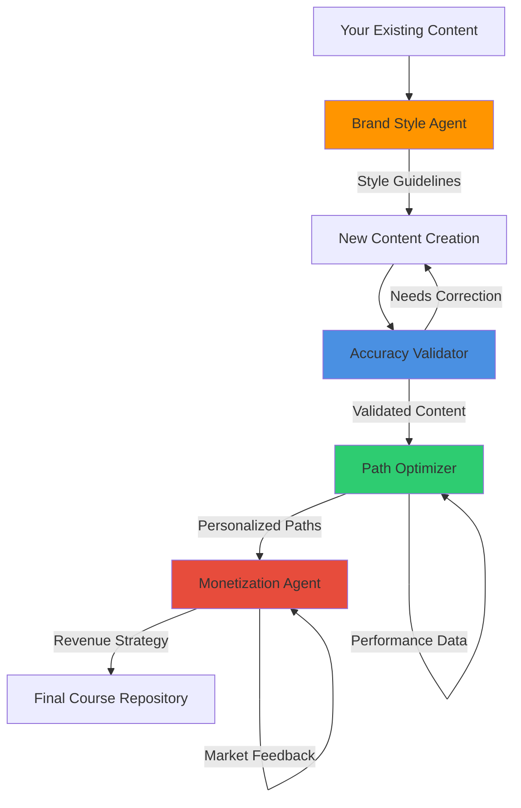

# Agent Collaboration Demonstration

## 🤝 How Your 4 Core Agents Work Together

### Real-World Workflow Example

Let's trace how these agents collaborate to create, validate, personalize, and monetize your Bitcoin education content:

## 🎨 STEP 1: Brand Style Learning Agent

**Input:** Your existing Canva designs and published content

**Process:**
```
┌─────────────────────────────────────────────────────────┐
│ BrandStyleLearningAgent.analyze_published_content()    │
│                                                         │
│ Analyzes: "Understanding Bitcoin: First Principles"    │
│                                                         │
│ Discovers:                                              │
│ • Teaching Style: First principles approach            │
│ • Brand Voice: Authoritative yet approachable          │
│ • Methodology: Socratic questioning                    │
│ • Visual Style: Clean, orange/yellow color scheme        │
│ • Engagement: Uses analogies and real-world examples   │
└─────────────────────────────────────────────────────────┘
```

**Output:** Brand style guidelines that ensure all future content maintains your unique voice and visual identity.

---

## 🔍 STEP 2: Content Accuracy Validator

**Input:** New lesson content + Brand style guidelines

**Process:**
```
┌─────────────────────────────────────────────────────────┐
│ ContentAccuracyValidator.validate_bitcoin_content()     │
│                                                         │
│ Validates:                                              │
│ ✅ Bitcoin's 21M supply cap correctly stated           │
│ ✅ Mining difficulty adjustment explained accurately    │
│ ✅ No common misconceptions present                     │
│ ✅ Technical details verified against authoritative     │
│    sources (Bitcoin Core, BIPs, academic papers)       │
│                                                         │
│ Score: 92% accuracy (Approved for publication)         │
└─────────────────────────────────────────────────────────┘
```

**Output:** Verified, accurate content with corrections and brand consistency maintained.

---

## 🎯 STEP 3: Learning Path Optimizer

**Input:** Validated content + Student assessment data

**Process:**
```
┌─────────────────────────────────────────────────────────┐
│ LearningPathOptimizer.generate_personalized_path()     │
│                                                         │
│ Student Profile: Sarah (Sovereignty Seeker)            │
│ • Bitcoin knowledge: Basic                              │
│ • Learning style: Visual                                │
│ • Goal: Personal sovereignty                            │
│ • Time: Few hours/week                                  │
│                                                         │
│ Generated Path:                                         │
│ Phase 1: Money Theory → Bitcoin Basics                 │
│ Phase 2: Custody → Privacy                              │
│ Phase 3: Lightning → Advanced Sovereignty              │
│                                                         │
│ Personalization:                                        │
│ • Visual-heavy content for Sarah's learning style      │
│ • 30-minute sessions (fits her schedule)               │
│ • Practical exercises for sovereignty goals            │
└─────────────────────────────────────────────────────────┘
```

**Output:** Personalized learning paths that maximize student success and engagement.

---

## 💰 STEP 4: Course Monetization Agent

**Input:** Personalized content + Market analysis

**Process:**
```
┌─────────────────────────────────────────────────────────┐
│ CourseMonetizationAgent.analyze_market_opportunities()  │
│                                                         │
│ Market Analysis:                                        │
│ • TAM: $2.5B Bitcoin education market                  │
│ • SAM: $350M premium education segment                 │
│ • Target: Retail investors + sovereignty seekers       │
│                                                         │
│ Pricing Strategy:                                       │
│ • Free Tier: 30% of content (trust building)          │
│ • Essential: $39/month (core audience)                 │
│ • Mastery: $89/month (advanced learners)               │
│ • Enterprise: Custom pricing (B2B)                     │
│                                                         │
│ Revenue Projection: $50K-150K ARR Year 1               │
└─────────────────────────────────────────────────────────┘
```

**Output:** Optimized pricing strategy that balances accessibility with sustainability.

---

## 🔄 AGENT COLLABORATION WORKFLOW

### How They Work Together:



### Real Integration Example:

1. **Content Creation Loop:**
   - Brand Agent ensures new lesson matches your teaching style
   - Accuracy Agent validates all Bitcoin facts
   - Path Agent places lesson in optimal sequence
   - Monetization Agent determines pricing tier

2. **Student Experience Loop:**
   - Path Agent creates personalized journey
   - Brand Agent ensures consistent experience
   - Accuracy Agent guarantees correct information
   - Monetization Agent optimizes conversion

3. **Continuous Improvement Loop:**
   - All agents learn from student performance
   - Brand Agent refines style based on engagement
   - Accuracy Agent updates knowledge base
   - Path Agent optimizes sequences
   - Monetization Agent adjusts pricing

---

## 🚀 INTEGRATION CAPABILITIES

### What This Means for Your Business:

✅ **Scalable Content Creation:** Brand agent maintains your voice across unlimited content

✅ **Zero Misinformation Risk:** Accuracy agent prevents any misleading Bitcoin education

✅ **Personalized at Scale:** Path agent creates custom experiences for thousands of students

✅ **Revenue Optimization:** Monetization agent maximizes income while maintaining accessibility

✅ **Self-Improving System:** All agents adapt and improve based on real performance data

---

## 🎯 NEXT STEPS

### Ready to Create Your Comprehensive Repository:

1. **Feed Real Data:** Connect agents to your actual Canva designs and content
2. **Process Existing Courses:** Run all current content through accuracy validation
3. **Generate Multiple Paths:** Create learning paths for different audiences
4. **Implement Monetization:** Deploy optimized pricing and revenue strategies
5. **Launch & Optimize:** Use agent feedback loops for continuous improvement

---

## ✨ THE POWER OF COLLABORATION

Your 4 agents working together create a self-correcting, self-improving Bitcoin education system that:

- **Maintains Your Brand** while scaling infinitely
- **Ensures Accuracy** across all content automatically
- **Personalizes Learning** for maximum student success
- **Optimizes Revenue** without compromising mission

**Result:** The most comprehensive, accurate, personalized, and sustainable Bitcoin education platform possible! 🔥

---

*Ready to build the remaining 14 agents and create your complete Bitcoin education empire?*
